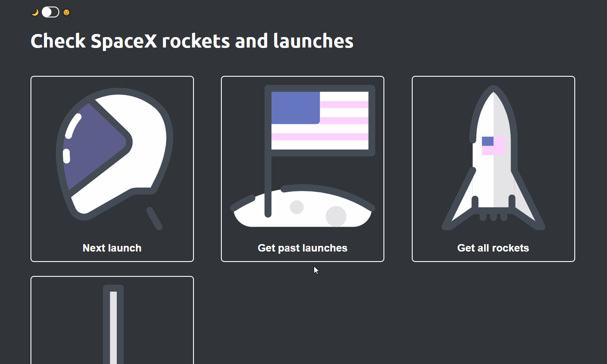

# Landing page build with spacex API 🚀

###Live demo:🚀 [here](https://distracted-northcutt-33eeec.netlify.app)

#### You can check:
- Next launch
- Past launches
- Rockets
- Upcoming launches

#### Future tasks:

- [ ] Add more information about rockets
- [ ] Add countdown timer for next launch

#### Used API: [here](https://github.com/r-spacex/SpaceX-API)
